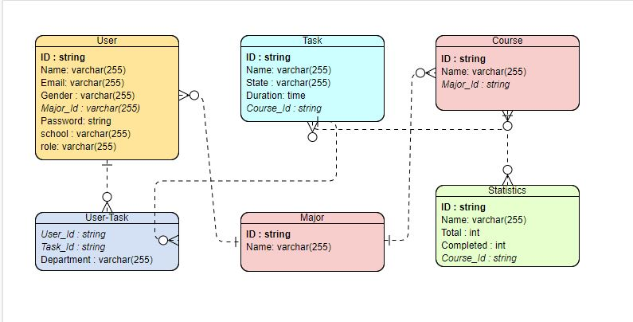

# README

## Jadwaleh

### Table of Contents

* [About the Project](./#about-the-project)
* [Wireframes](./#Wireframes)
* [User Stories](./#User-Stories)
* [Domain Modeling](./#Domain-Modeling)
* [Contributors](./#Contributors)
* [Entity Relationship Diagram](./#Entity-Relationship-Diagram)
* [License](./#license)

## About the Project

This would be an demo of a social-educational app. Through it, the user will get a service of organizing their own study hours throughout the week, many different factors are taken into account to make some personalization possible, within reason.

#### Entity Relationship Diagram

**MVP** : 1. Deliver a weekly study timetable with minimal clicking and maximum value. 2. Allow users to regain control of focus during study time, by keeping relevant interactions in \(in-app study chat & QA\), and unnecessary distractions out. 3. Provide a semi-direct and instantaneous feedback on performance and a valuable reference point for future projections.

To see more on the project requirements, click on [this.link](requirements.md).

### UML

[Click to See the UML Case Use Diagram](https://github.com/Khobaraa/Jadwaleh/tree/54470c4d3e8103e03c5d94e19f90c4f2bb567db7/resources/UML/README.md)

## Wireframes

[Click to See the Wireframe](assets/wireframe.md)

## User Stories

[Project management board](https://trello.com/b/4tUApXJe/jadwalla)

## Domain Modeling

 N/A

## Entity Relationship Diagram

## Contributors

* [Ahmad Al-Habrawi](https://github.com/ahmadmamdouh1995)
* [Ashjan Al-Barqi](https://github.com/AAlbarqi)
* [Osama Hanoun](https://github.com/OsamaHanoun)
* [Yahya Abu Khalil](https://github.com/AbuKhalil95)

## License

Distributed under the MIT License. See [LICENSE](https://www.mit.edu/~amini/LICENSE.md) for more information.

