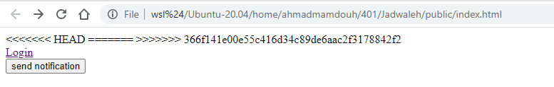

# Oauth with Google







Redirect "https://accounts.google.com/o/oauth2/v2/auth" to our localhost to make the third party login .








return token "eyJhbGciOiJIUzI1NiIsInR5cCI6IkpXVCJ9.eyJ1c2VybmFtZSI6Im1hbWRvdWg0ODZAZ21haWwuY29tIiwiaWF0IjoxNjAyMDE5NzI0fQ.Cdsx1f9\_ANjw-hGp6uoVXacTLjtf-LHRUc9e\_E-9YeU"  
this result after using JWT encoded 


```
{
  "username": "mamdouh486@gmail.com",
  "iat": 1602019724
}
```







